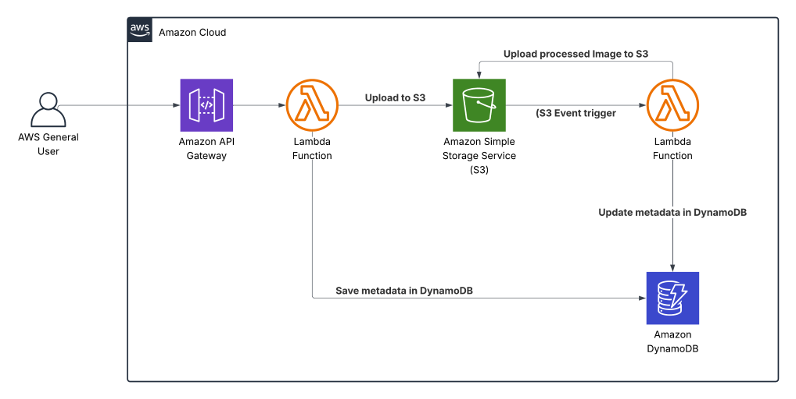

# 🖼️ Serverless Image Processing with S3 and Lambda

This project demonstrates a **serverless** architecture for uploading and processing images using **AWS services**. It leverages **Terraform** for infrastructure as code

---

## ⚙️ AWS Services Used
- **API Gateway** – HTTP API for uploading images
- **Lambda** – serverless compute for upload & processing
- **S3** – storage for original & processed images
- **DynamoDB** – image metadata storage
- **CloudWatch** – monitoring & logs
- **IAM** – fine-grained security roles/policies

---

## 🏗️ Architecture

  

## Demo Video
[Watch the project demo](https://drive.google.com/file/d/131Fyjje7IaSVtZQbAodictnri4E3HCHV/view?usp=sharing)

## 🛠️ Setup & Deployment

### Prerequisites
- Terraform
- Python 3.12 (for Lambda packaging)    

### Deployment
```bash
# Clone the repo
git clone https://github.com/omarnabil1998/Serverless-REST-API-with-DynamoDB-and-API-Gateway.git
cd image-processing-aws

# Package process Lambdas with pillow dependency
pip install Pillow -t lambda/process

# Initialize Terraform
terraform init

# Review the plan
terraform plan

# Apply infrastructure
terraform apply -auto-approve